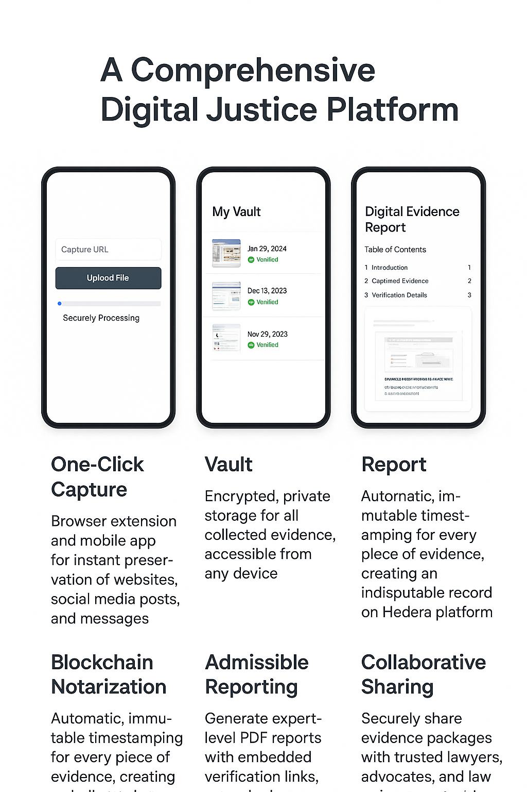
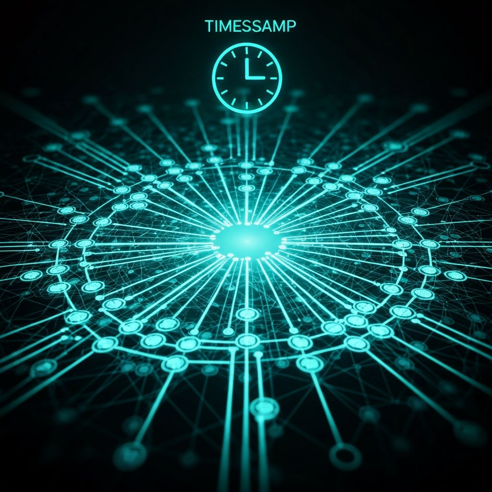
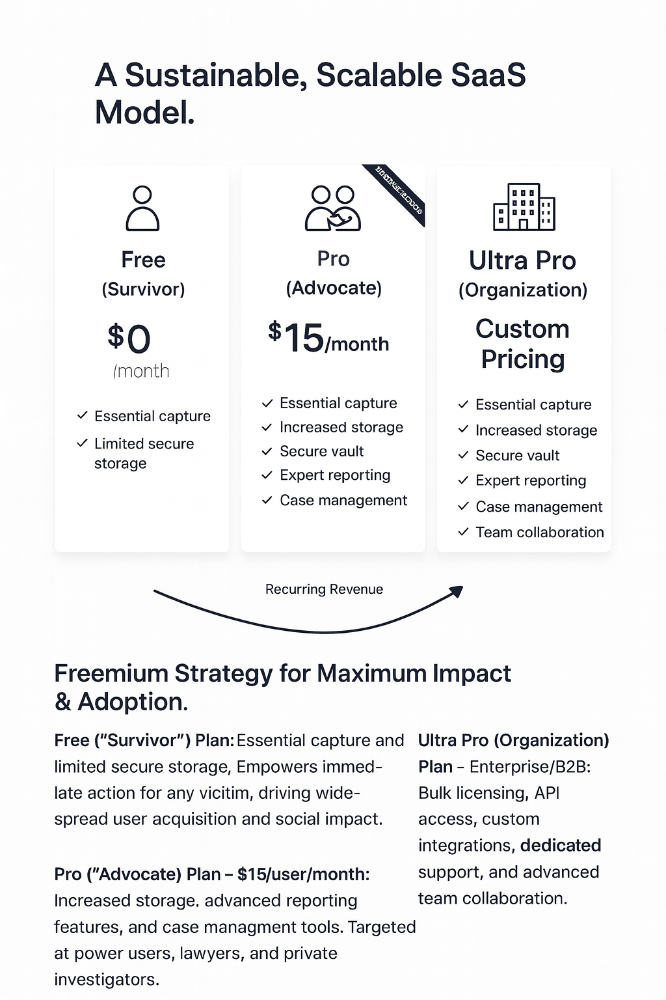

<p align="center">
  <a href="#" target="_blank">
    
  </a>
</p>

<h1 align="center">Digital Evidence Vault</h1>

<p align="center">
  A secure, privacy-focused web application designed to help victims of Gender-Based Violence (GBV) safely store, manage, and verify digital evidence.
</p>

<p align="center">
  
  
  
</p>

<p align="center">
  <a href="https://v0-digital-evidence-vault-gbv-hacka.vercel.app/" target="_blank">🚀 Live Demo</a> •
  <a href="https://www.canva.com/design/DAG6cN3ZeVI/xx_V6sA4mpsFlcjMDAoOuA/view?utm_content=DAG6cN3ZeVI&utm_campaign=designshare&utm_medium=link2&utm_source=uniquelinks&utlId=h4b5757b832" target="_blank">💡 Pitch Deck</a>
</p>

<p align="center">
  <a href="#-about-the-project">About</a> •
  <a href="#-key-features">Features</a> •
  <a href="#-tech-stack">Tech Stack</a> •
  <a href="#-getting-started">Getting Started</a> •
  <a href="#-roadmap">Roadmap</a> •
  <a href="#-contributing">Contributing</a> •
  <a href="#-license">License</a> •
  <a href="#-contact">Contact</a>
</p>

---

## The Problem Statement

<p align="center">
  
</p>

---

## 📖 About The Project

<p align="center">
  
</p>

The **Digital Evidence Vault** is a crucial tool for individuals facing Gender-Based Violence, providing a secure and private platform to document and preserve evidence. In legal cases, the integrity and chronological order of evidence are paramount. This application empowers users by allowing them to upload various forms of digital evidence (photos, videos, documents), which are then cryptographically hashed on the client-side.

This process ensures that the user's sensitive data is never exposed, while creating an immutable "digital fingerprint" of the evidence. This fingerprint can be used to verify the authenticity and integrity of the evidence at a later date, without revealing the content itself. The platform also simulates integration with the Hedera blockchain to create a tamper-proof timestamp, further strengthening the legal admissibility of the evidence.

### Our Mission
To provide a safe, secure, and user-friendly tool that empowers survivors of GBV to take control of their narrative and seek justice.

---

## Our Solution

<p align="center">
  
</p>

---

## ✨ Key Features

-   **🔐 Client-Side Hashing:** All files are hashed in the browser (SHA-256) before upload, ensuring user privacy and data integrity. Only the hash is sent to the server.
    <p align="center">
      
    </p>
-   **🗂️ Case Management:** Organize evidence into distinct cases, making it easy to manage and present.
-   **🔗 Hedera Integration (Simulated):** Simulates timestamping evidence on the Hedera Hashgraph network for immutable proof of existence.
    <p align="center">
      
    </p>
-   **📈 Interactive Dashboard:** A comprehensive overview of your cases, evidence, and activity.
    <p align="center">
      
    </p>
-   **💻 Modern & Responsive UI:** Built with Next.js, Tailwind CSS, and Shadcn/UI for a seamless experience on any device.
-   **📥 Data Export:** Easily export your evidence and case data when you need it.

---

## 🎨 User Interface

<p align="center">
  
  <em>The user dashboard provides a comprehensive overview of cases and evidence.</em>
</p>

<p align="center">
  
  <em>Securely upload and manage your digital evidence with client-side hashing.</em>
</p>

<p align="center">
  
  <em>Organize your evidence into cases for easy management and presentation.</em>
</p>

<p align="center">
  
  <em>View detailed information for each piece of evidence, including its hash and timestamp.</em>
</p>

---

## 🛠️ Tech Stack

This project is built with a modern, robust, and scalable tech stack:

-   **[Next.js](https://nextjs.org/):** A React framework for building full-stack web applications.
-   **[TypeScript](https://www.typescriptlang.org/):** A strongly typed programming language that builds on JavaScript.
-   **[Tailwind CSS](https://tailwindcss.com/):** A utility-first CSS framework for rapid UI development.
-   **[Shadcn/UI](https://ui.shadcn.com/):** A collection of re-usable components built using Radix UI and Tailwind CSS.
-   **[Prisma](https://www.prisma.io/):** A next-generation ORM for Node.js and TypeScript.
-   **[PostgreSQL](https://www.postgresql.org/):** A powerful, open-source object-relational database system.
-   **[Clerk](https://clerk.com/):** A complete user management solution for authentication and authorization.
-   **[Hedera Hashgraph](https://hedera.com/):** A decentralized public network for building and deploying dApps.

---

## 🚀 Getting Started

To get a local copy up and running, follow these simple steps.

### Prerequisites

-   [Node.js](https://nodejs.org/en/) (v18 or higher)
-   [pnpm](https://pnpm.io/installation) (or npm/yarn)
-   [Docker](https://www.docker.com/get-started) (for running a local PostgreSQL database)

### Installation

1.  **Clone the repository:**
    ```sh
    git clone https://github.com/T-G-C/v0-digital-evidence-vault-gbv-hackathon.git
    cd v0-digital-evidence-vault-gbv-hackathon
    ```

2.  **Install dependencies:**
    ```sh
    pnpm install
    ```

3.  **Set up environment variables:**
    Create a `.env` file in the root of the project and add the following variables. You can use the `.env.example` file as a template.
    ```env
    # .env
    DATABASE_URL="postgresql://<user>:<password>@<host>:<port>/<dbname>?sslmode=require"

    # Clerk
    NEXT_PUBLIC_CLERK_PUBLISHABLE_KEY=""
    CLERK_SECRET_KEY=""

    # Hedera Configuration - Get these from the Hedera Developer Portal (https://portal.hedera.com/)
    HEDERA_ACCOUNT_ID="YOUR_HEDERA_ACCOUNT_ID"
    HEDERA_PRIVATE_KEY="YOUR_HEDERA_PRIVATE_KEY"
    HEDERA_TOPIC_ID="YOUR_HEDERA_TOPIC_ID"
    ```

4.  **Set up the database:**
    Run the following command to apply database migrations:
    ```sh
    pnpm prisma migrate dev
    ```

5.  **Run the development server:**
    ```sh
    pnpm dev
    ```

The application should now be running at [http://localhost:3000](http://localhost:3000).

---

## 🗺️ Roadmap

-   [ ] **Full Hedera Integration:** Move from a simulated to a live Hedera integration.
-   [ ] **End-to-End Encryption:** Implement end-to-end encryption for all user data.
-   [ ] **AI-Powered Insights:** Use AI to help users categorize and tag evidence.
-   [ ] **Legal Professional Collaboration:** Allow users to securely share evidence with legal professionals.
-   [ ] **Mobile Application:** Develop a native mobile application for iOS and Android.

See the [open issues](https://github.com/T-G-C/v0-digital-evidence-vault-gbv-hackathon/issues) for a full list of proposed features (and known issues).

---

## 🤝 Contributing

Contributions are what make the open source community such an amazing place to learn, inspire, and create. Any contributions you make are **greatly appreciated**.

If you have a suggestion that would make this better, please fork the repo and create a pull request. You can also simply open an issue with the tag "enhancement".
Don't forget to give the project a star! Thanks again!

1.  Fork the Project
2.  Create your Feature Branch (`git checkout -b feature/AmazingFeature`)
3.  Commit your Changes (`git commit -m 'Add some AmazingFeature'`)
4.  Push to the Branch (`git push origin feature/AmazingFeature`)
5.  Open a Pull Request

---

## 👥 Contributors

-   B_rian <129996774+WellBrian@users.noreply.github.com>
-   Captain AI <47535049+snjugunanjenga@users.noreply.github.com>
-   JoyWanjiru00 <150961674+JoyWanjiru00@users.noreply.github.com>
-   JoyWanjiru00 <shirujoylitta@gmail.com>
-   simpleHacker0893 <simplenjenga4@gmail.com>
-   

---

## 📄 License

Distributed under the MIT License. See `LICENSE` for more information.

---

## 📞 Contact

Project Link: [https://v0-digital-evidence-vault-gbv-hacka.vercel.app/](https://v0-digital-evidence-vault-gbv-hacka.vercel.app/)

---

<p align="center">
  <em>A sanctuary for truth, a fortress for justice.</em>
</p>